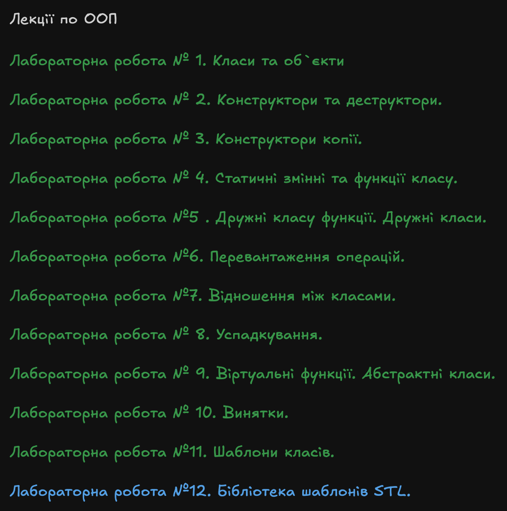
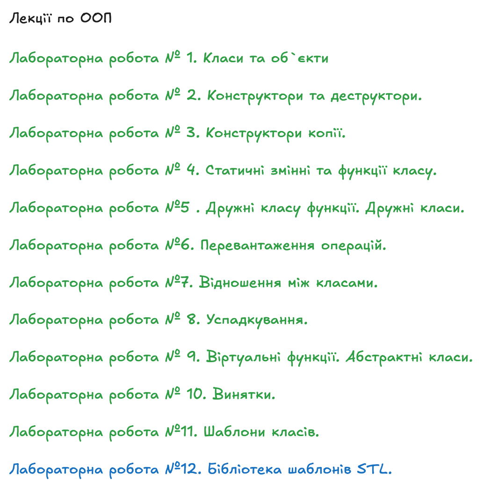

# Лабораторні роботи з ООП

### Темна тема

> 🟢 **Зелений колір** - виконані роботи  
> 🔵 **Синій колір** - роботи в процесі виконання  
> 🔴 **Червоний колір** - не виконані роботи

### Світла тема

